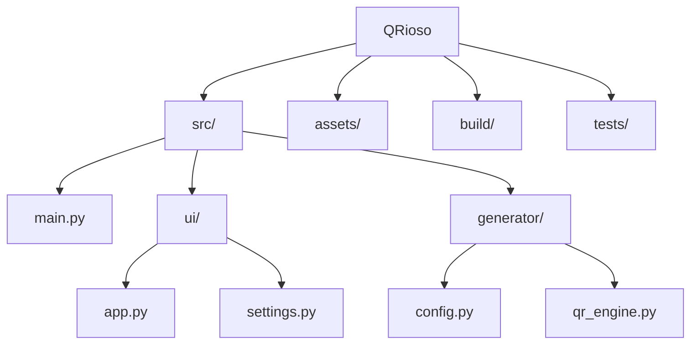

# QRioso

QR code generator project with GUI, developed using `uv` as the Python manager, hence the [requirements](/requirements.txt), [toml](/pyproject.toml), [uv lock](/uv.lock), and `.gitignore` files configurations.

> [!NOTE]
> (23/03/26) I, Alejandro Jiménez, creator of this project, am not a pro, not even a CS nor Systems engineering student, but another engineering student loving the process of learning programming, and the open source community.
> There may be way better free QR code generators, but I wanted one of my own as a passion project.
> Aiding myself with AI, caffeine, and my future wife's support, I want my projects to be of some motivation, not only for me, but hopefully others as well, anyone that may stumble upon this repo in the future, to take some time each day, learn something new, and build stuff of their own, or even collaborate on open projects like this.
> Be better than your yesterday's self.

- [QRioso](#qrioso)
  - [Build settings](#build-settings)
    - [Python version](#python-version)
    - [Used libraries and dependencies](#used-libraries-and-dependencies)
      - [CustomTkinter (Not yet used)](#customtkinter-not-yet-used)
      - [QRcode](#qrcode)
      - [Segno (Not yet used)](#segno-not-yet-used)
      - [PyInstaller](#pyinstaller)
      - [Pytest](#pytest)
  - [Build guide](#build-guide)
  - [Structure](#structure)
    - [assets](#assets)
    - [src](#src)
      - [generator](#generator)
      - [ui](#ui)
    - [tests](#tests)
  - [Default settigns](#default-settigns)


## Build settings

### Python version

Project built and tested using Python 3.11.15.

### Used libraries and dependencies

These may change as the project progresses.

#### CustomTkinter (Not yet used)

v5.2.0. GUI's chosen library.

#### QRcode

v7.4.2 as the code's generator, combined with the `pillow` v10.0.0 dependency for image manipulation

#### Segno (Not yet used)

v1.6.0 To aid in SVG format output

#### PyInstaller

v6.0.0 As the execuable generator, hoping to make the program as accessible and easy to use as possible

#### Pytest

v8.0.0 To use for unit testing of the project

## Build guide

Desde el root del proyecto ejecutar:

```
uv run pyinstaller qrioso.spec
```

## Structure




### assets

Only content (so far) are the .ico and .png logo files.

### src

- [main](/src/main.py)

#### generator

- [config](/src/generator/config.py)
- [engine](/src/generator/qr_engine.py)

#### ui

- [app](/src/ui/app.py)
- [settings](/src/ui/settings.py)

### tests

- [test_qr_engine](/tests/test_qr_engine.py)

Unit tests for the qr code generator.

## Default settigns

| Settings         | Default            |
| ---------------- | ------------------ |
|                  |                    |
| **QR**           |                    |
| Output folder    | ~/Documents/qrioso |
| Format           | PNG                |
| Box size         | 10 px              |
| Border           | 4 px               |
| Error correction | M ~15%             |
| QR color         | Black              |
| QR background    | White              |
|                  |                    |
| **UI**           |                    |
| Width            | 600                |
| Height           | 520                |
| Appearance       | System set         |
| Color theme      | Blue               |